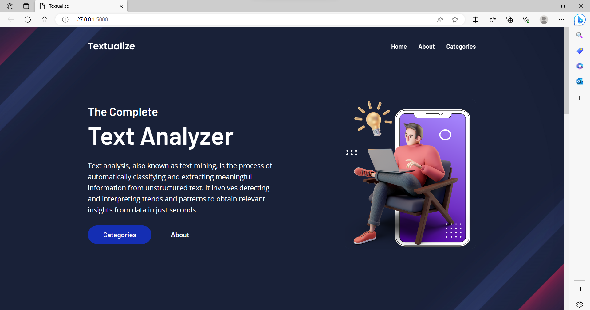
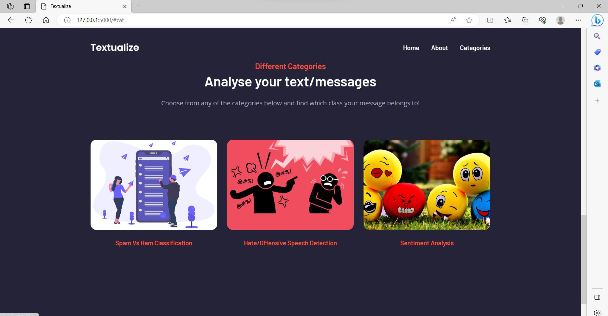
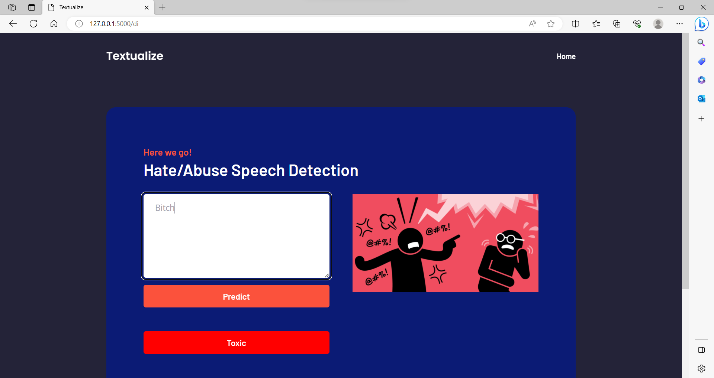

<h1 align="center">
             Textualize
</h1>

This app is used to perform an indepth analysis of a text. 
The analysis sections include ->

**1. Spam or Ham Detection**

**2. Hate & Offensive Content Detection**

**3. Sentiment Analysis**

## Tech Stack Used

## Libraries Used

    

## Structure Of The Project

- Each prediction page is connected with a Machine Learning Model which uses either of Logistic Regression or Support Vector Machine Algorithms to predict the results.
- There are 3 different datasets being used for each prediction.
- User lands into each prediction site of the web app from the options in the Navigation Menu.
- Only 1 relevant feature taken into consideration which is the text and then the text is preprocessed and vectoized with help of TF-IDF Vectorizer to fit into the model and tain it.
- So the user gets a broad overview of the text after the analysis

## The feature taken into consideration

| Text Analysis Type | Feature |
| - | - |
| Spam or Ham Detection Page | Text |
| Hate & Offensive Content Page | Text |
| Sentiment Analysis Page | Text |

The text is preprocessed then fed to the model.

## Glance At The Application- 

### 1. Home Page

### 2. Categories

### 3. Hate Speech Detection

### 4. Prediction

